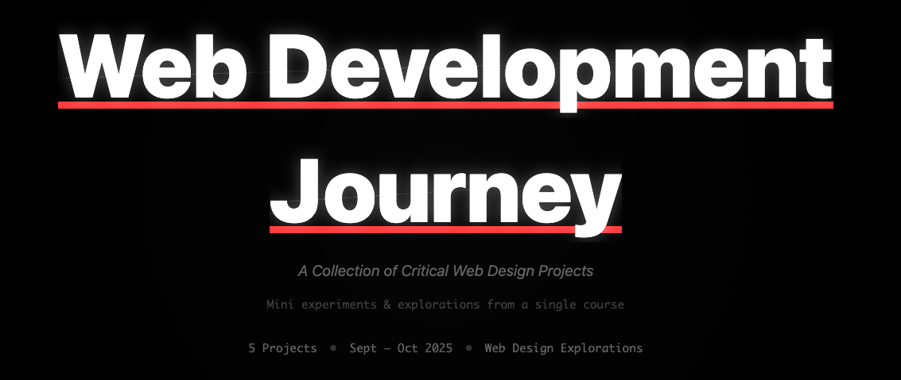

# Web Development Journey

**[🌐 Live Gallery](https://dmku33.github.io/mini-frontend-gallery/)**

Gallery of 5 mini web development projects with black & white aesthetic and split-text hover effects. Built with vanilla JavaScript, CSS clip-path, and Intersection Observer API.

## Projects

1. **View Source** - ASCII art concrete poem about wildlife protection with interactive hover effects
2. **Unbranding** - Critical design using Three.js 3D blocks to question Cursor as a "visionary" product
3. **On the Grid** - Financial dashboard demonstrating Bootstrap grid with Chart.js stock visualizations
4. **Usability Test** - UX research dashboard presenting alphaXiv platform usability test results
5. **Regenerative** - "Pixel Chronicles" - location & time-based generative pixel art landscapes

## Live Projects

All projects are hosted on GitHub Pages:
- [View Source](https://dmku33.github.io/web-dev-view-source/)
- [Unbranding](https://dmku33.github.io/web-dev-unbranding/)
- [Grid Layout](https://dmku33.github.io/web-dev-grid-layout/)
- [Usability Test](https://dmku33.github.io/web-dev-usability-test/)
- [Regenerative](https://dmku33.github.io/web-dev-regenerative-design/)

---

*Mini experiments & explorations from a single course*

**Note:** These are small learning projects completed as part of a web design course. They're experimental exercises exploring different web techniques, not production-ready applications.

